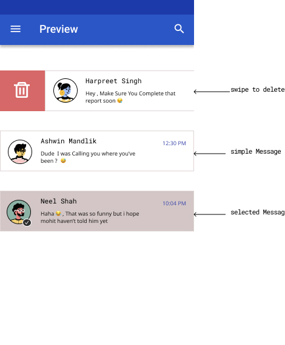

# Advanced-chat-view
<b>UNDER BUILD..🌐(LATEST STABLE WILL BE RELEASED SOON)   
Advanced Chat View For all the chatting or texting applications out there !! 🐸 ,, The Idea is to build a chat view that can we use for creating applications that implements chatting or messaging with ease and advanced feature

## Offer Features Like
* User Can swipe the message to perform specific action , user can swipe a message to delete it 
      or archive it  (we can define listeners to do any action on swipe or so) .
      
* User Can Long press to select a message and we can add customize on 
      long press action listener to do specific task .
     
* Also There would be a unread message count just like we have in apps like whatsapp 
      to tell the user count of messages that he/she haven't read from a specific person.
      
* Also There would be time and date to a message that will tell the time or date messag was received.

* To Make the Ui more interactive and friendly there would be some animations to the View 
 

## Preview 

